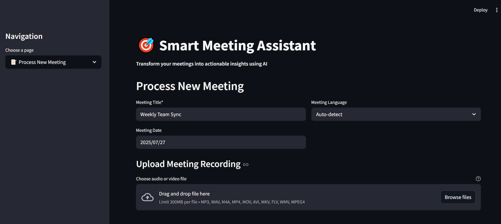
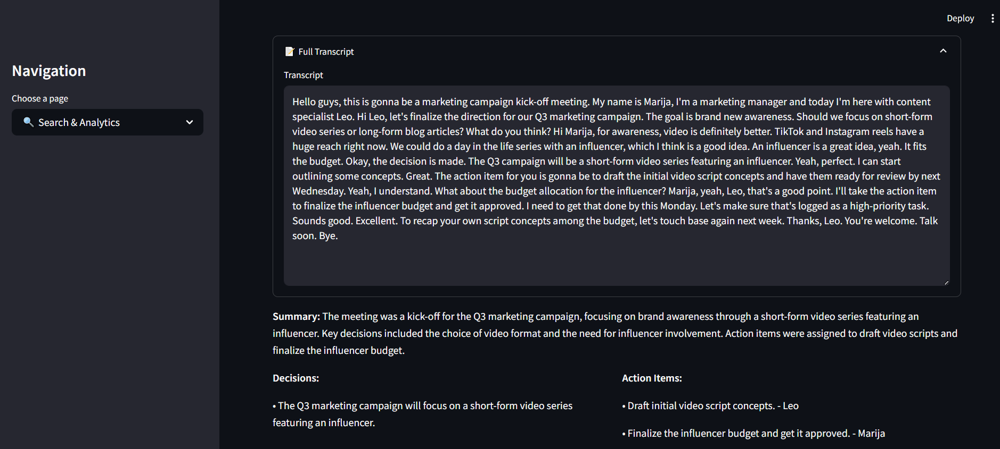
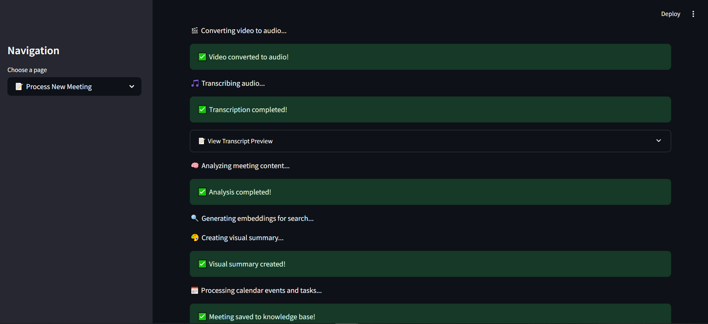
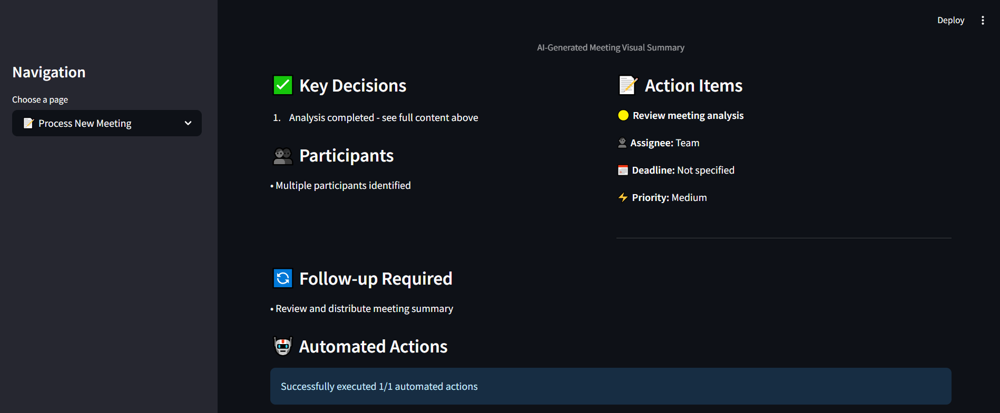
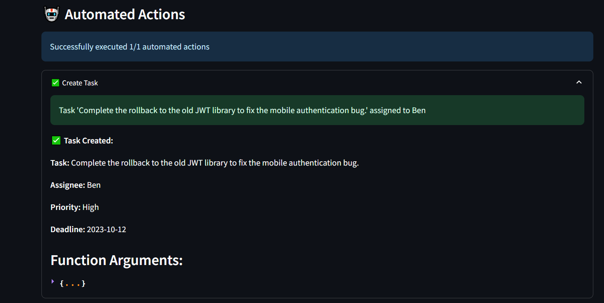
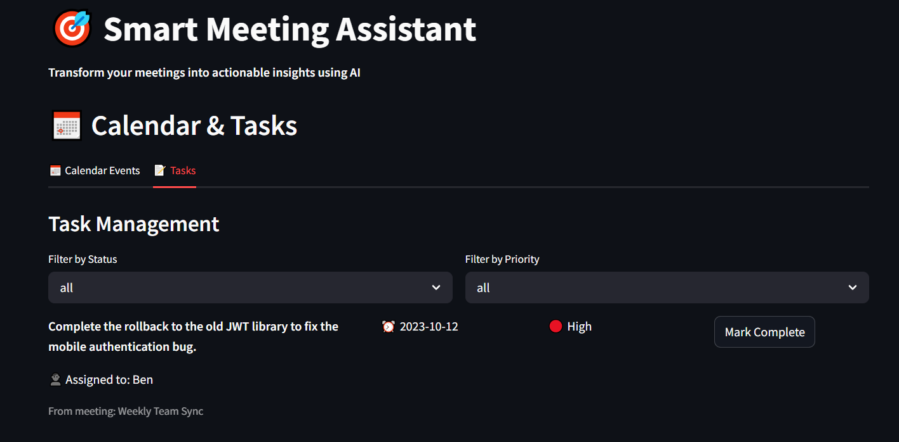

# 🎯 Smart Meeting Assistant - Asistentunia

An advanced AI-powered web application designed to automatically process meeting recordings, extract actionable insights, and create a searchable organizational knowledge base. This project was developed to address the challenge of ineffective meetings, transforming spoken conversations into structured, valuable data.

---
## Demo 🐛


> My app provides a streamlined way to manage your meetings. Simply upload your video or audio recordings, and we'll automatically generate a full transcript, analyze the content, produce a concise summary, identify individual speakers, and extract important decisions and action items
---


---


---


---


---



> Here you can see that the task is assigned to Ben


---

## ✨ Key Features

- **Multi-API Integration**: Seamlessly integrates four core OpenAI APIs (Whisper, GPT-4o, DALL-E 3, and Embeddings) into a single, cohesive workflow.
- **Advanced Audio Processing**: Transcribes audio and video recordings (`.mp3`, `.wav`, `.mp4`, etc.) using Whisper, with support for multiple languages.
- **Intelligent Content Analysis**: Utilizes GPT-4o with Function Calling to:
    - Generate executive summaries.
    - Extract key decisions and action items.
    - Identify meeting participants.
- **Automated Task & Event Creation**: Automatically creates calendar events and tasks based on the meeting's content, bridging the gap between discussion and action.
- **Semantic & Keyword Search**: A powerful hybrid search engine allows users to find information across all meetings using either natural language queries (semantic) or specific terms (keyword).
- **Visual Synthesis**: Generates professional, infographic-style visual summaries of meetings using DALL-E 3, perfect for stakeholders and non-attendees.
- **Comprehensive Dashboard & Management**: Features a multi-page interface for processing new meetings, searching the knowledge base, viewing analytics, managing a calendar, and deleting old records.
- **Low-Resource Language Support**: Provides translation and cross-language search capabilities for languages like Georgian, Slovak, etc.
- **Unit & Integration Testing**: Includes a suite of tests to ensure the reliability and correctness of core components.

---

## 🛠️ Tech Stack

- **Backend**: Python 3.9+
- **Frontend**: Streamlit
- **AI & Machine Learning**:
    - **OpenAI API**: Whisper, GPT-4o, DALL-E 3, Embeddings
    - **Translation**: `googletrans`
- **Database**: SQLite with Full-Text Search (FTS5)
- **File Processing**: `ffmpeg` for video-to-audio conversion
- **Testing**: `unittest`, `unittest.mock`

---

## 🚀 Setup and Installation

### Prerequisites
- Python 3.9 or higher
- `ffmpeg`: You must have `ffmpeg` installed on your system and available in your system's PATH. You can download it from [ffmpeg.org](https://ffmpeg.org/download.html).

### Installation Steps

1.  **Clone the repository:**
    ```bash
    git clone https://your-repository-url.git
    cd your-project-directory
    ```

2.  **Create and activate a virtual environment (recommended):**
    ```bash
    # For Windows
    python -m venv venv
    .\venv\Scripts\activate

    # For macOS/Linux
    python3 -m venv venv
    source venv/bin/activate
    ```

3.  **Install the required dependencies:**
    Create a `requirements.txt` file with the following content:
    ```
    streamlit
    openai
    python-dotenv
    googletrans==4.0.0-rc1
    requests
    watchfiles
    nest_asyncio
    numpy
    scikit-learn
    pandas
    ```
    Then, install the packages:
    ```bash
    pip install -r requirements.txt
    ```

4.  **Set up your environment variables:**
    Create a file named `.env` in the root directory of the project and add your OpenAI API key:
    ```
    OPENAI_API_KEY="sk-YourSecretOpenAI_ApiKeyHere"
    ```

---

## ▶️ Running the Application

Once the setup is complete, run the Streamlit application from your terminal:

```bash
streamlit run main.py


.
├── .streamlit/
│   └── config.toml        # (Optional) For custom Streamlit settings like max upload size.
├── ai_services.py         # Handles all interactions with OpenAI and Google Translate APIs.
├── database.py            # Manages the SQLite database, including storage, retrieval, and search.
├── main.py                # The main Streamlit application file containing the UI and page logic.
├── utils.py               # Contains helper functions for file handling, data formatting, etc.
├── test_meeting_assistant.py # Unit and integration tests for the application.
├── .env                   # Stores secret keys and environment variables.
└── README.md              # This file.